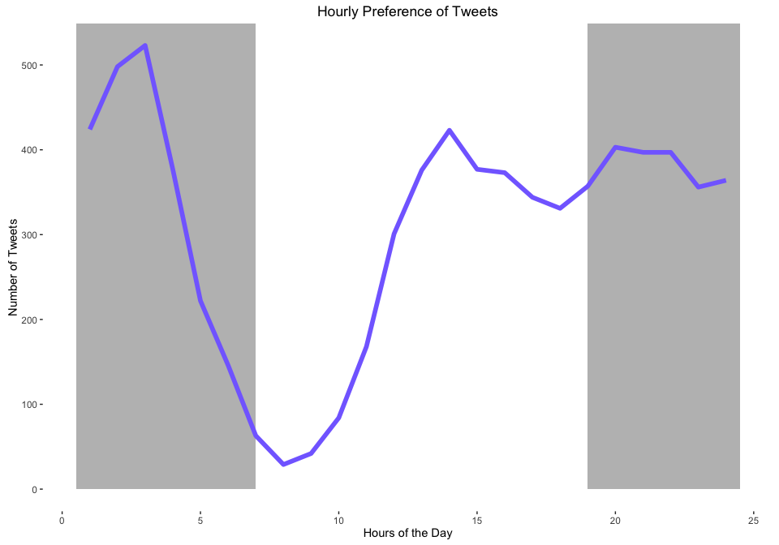
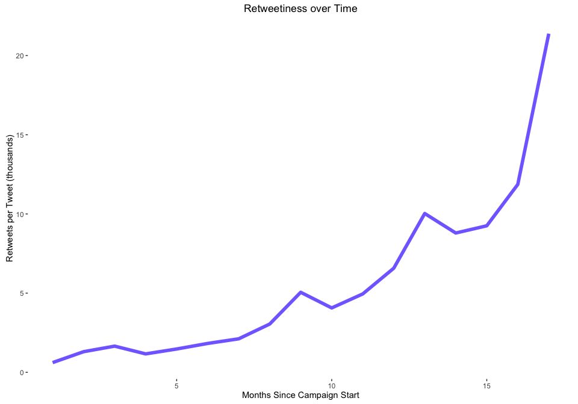
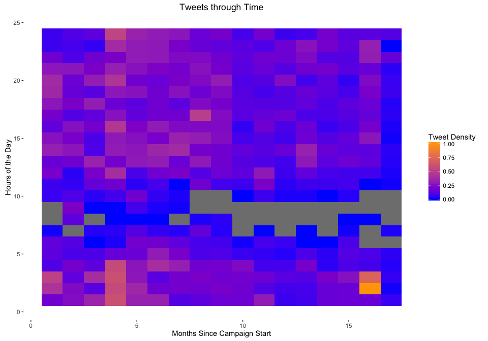
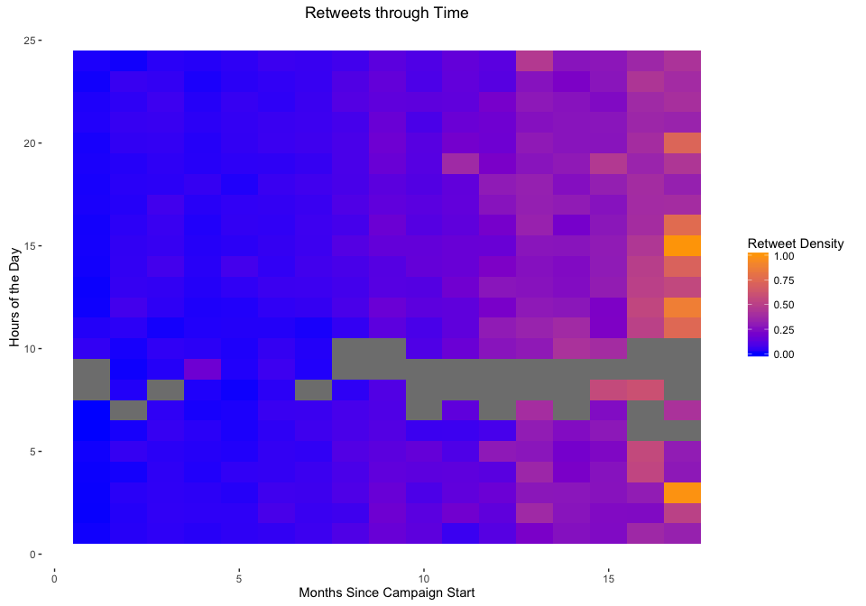
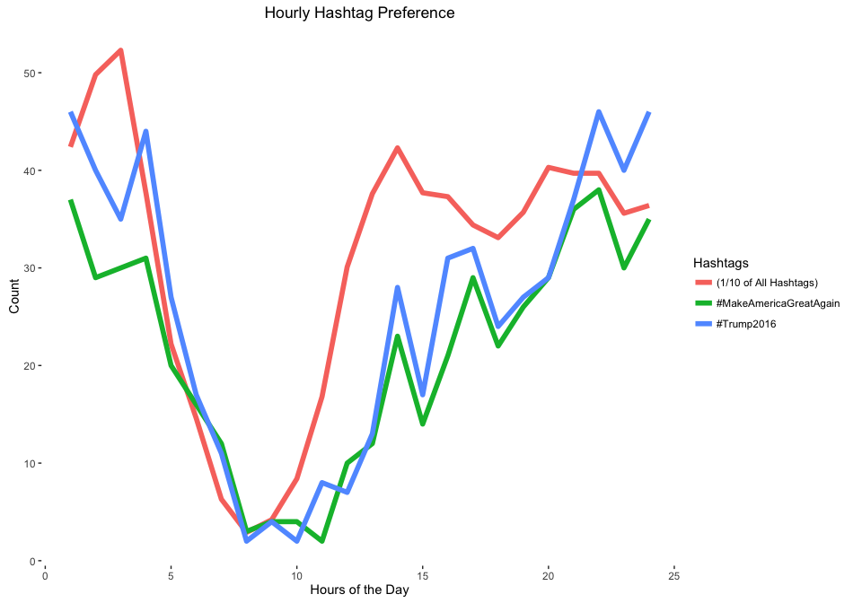
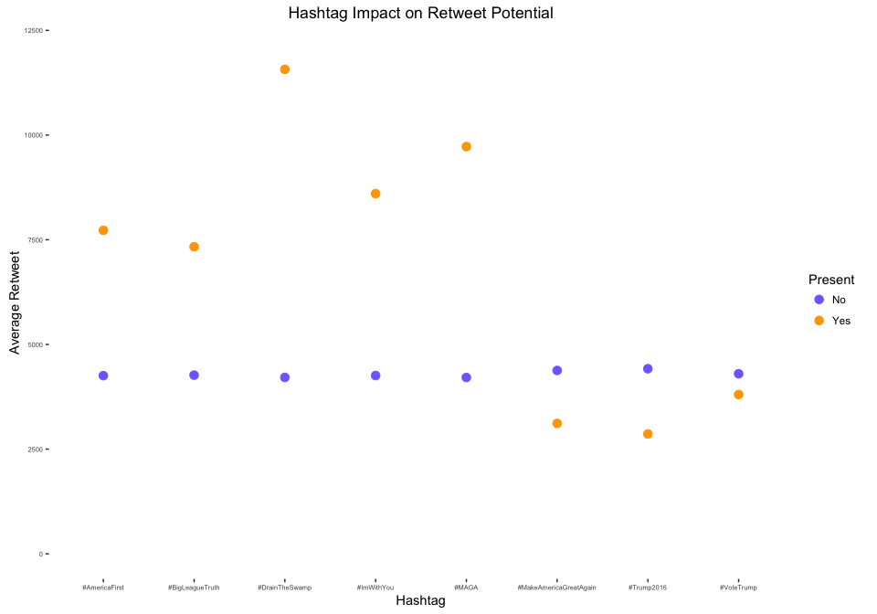
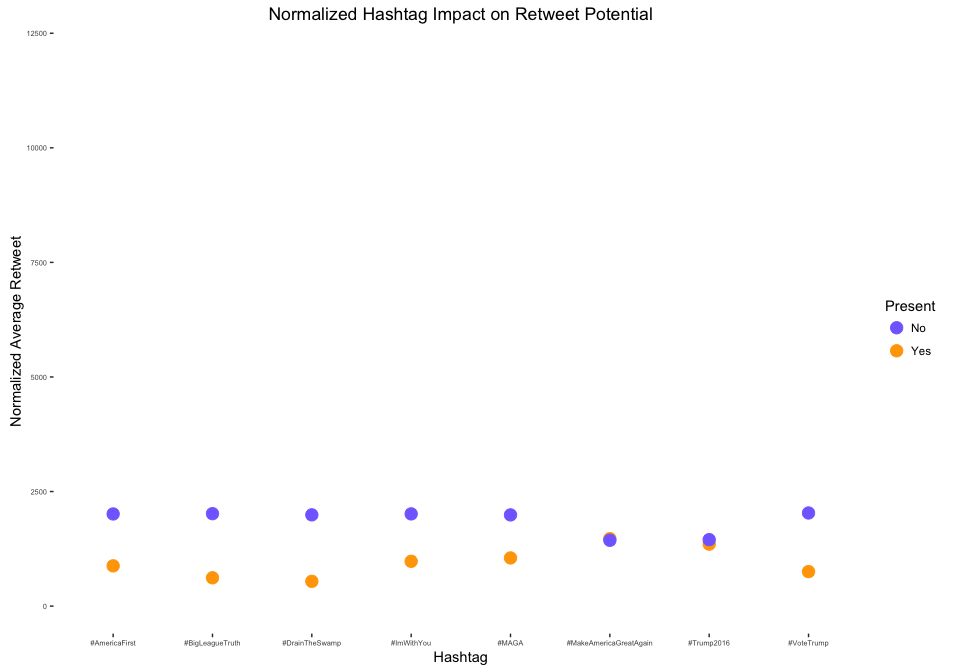

TrumpTweets
================

##### Since they make the news almost every day, it seemed worth poking around the infamous Trump tweets. This data set was pulled from [r/datasets](https://www.reddit.com/r/datasets/comments/5czkdz/7375_donald_trump_tweets_in_excel_and_csv/). It contains 7,375 tweets from Trump, starting from a month after announcing his candidacy until election day.

### Data Set

The data set includes dates and times for each tweet, the text contained, any hashtags used, and the number of retweets and favorites. This provided a great sandbox for experimenting with different data tools and to hunt for trends. When looking for trends, I used retweets as a proxy for popularity of tweets. Retweets and Favorites are very closely correlated (Adjusted *R*2 = 0.8815). A sample of the dataset below:

    ##        Date     Time                       Hashtags Retweets
    ## 8  16-11-09 02:48:27             ElectionNight;MAGA    45492
    ## 9  16-11-09 01:35:15                           <NA>    17169
    ## 10 16-11-08 23:20:39     MakeAmericaGreatAgain;VOTE    19710
    ## 11 16-11-08 23:20:09               MAGA;ElectionDay    11287
    ## 12 16-11-08 23:03:42 VoteTrump;iVoted;ElectionNight    25301
    ## 13 16-11-08 21:31:20                           <NA>    36745

### Hourly Trends

The first trend I aimed to explore was when Trump was tweeting. While the internet points out how early/late some of these tweets come out, I was curious if this was an actual trend, or an over-exaggeration. I was not disappointed.

**Hourly Preference of Tweets**: I was expecting the circadian rhythm to show up here, but I didn't expect for how offset it would be. I overlay daytime and nighttime on this graph for a better idea of what's going on. It appears that Trump regularly sleeps between 4:30-5am until 10-11am. Even as a college student, I don't think my hours were ever this skewed.

Also of interest, the peak tweeting hours don't happen at expected hours either. While Trump appears to tweet regularly throughout the day, the tweets really start flowing at the early hours in the morning. This could be free time, when the president doesn't have any scheduled meetings, or has more access to his phone.

I also looked to see if tweets of a certain hour had a higher rate of being retweeted, but there does not seem to be a pattern. There does seem to be on longer timescales however...

### Longer Trends

While many trends have hourly preferences, I changed the data into a monthly format as well. There were 17 months included in this dataset, so I had the choice of folding the data into bins by the 12 months of the year, or a progression of the 17 months of the campaign. I believe that there are fewer seasonal effects than longer campaign effects, so I binned the data as a progression, rather than seasons.

To see if the "effectiveness" of tweets increased over time, I graphed the retweets per tweet over this time scale.

**Retweetiness**: I'm using the technical term of "retweetiness" here to describe how often a tweet is expected to be retweeted. There is a very clear, logical trend as seen here, although its exact causes would be much more complicated to tease out. As Trump became a more well-known candidate and figure on the political stage, more people followed him on Twitter and retweeted him. This effect will come into play later.

If we were to combine the amount and influence of tweets throughout the campaign and over an hourly basis, we see a few new and old patterns.

**Tweets through Time**: We see in this heat-map a familiar trend over an hourly basis. There's a steep decline in the number of tweets occurring during the sleeping time period as we saw before. While there are many missing tiles further into the campaign, the earlier months show that at least once during these months, Trump tweeted during each hour of the day.

At the very end of the campaign, we see Trump tweeting less often, following a general decline overall. This contrasts with the number of retweets over this time frame.

**Retweets through Time**: We see the general trend of increased retweeting as time progresses, without a distinct time of day in which it occurs. It is also important to note that retweets do not have to occur at the same time as the tweet, so many 3am tweets are probably retweeted later in the morning when people wake up and check their phones. The vast majority of the retweeting/favoriting/etc occurs within 24 hours of the tweet, so I'm not concerned about missing data because it hasn't been retweeted yet.

### Exclamation Points!

One salient feature of how Trump tweets is how often he uses exclamation points. This graph explores whether or not there is an hourly preference on using exclamation points.

**Hourly Exclamations!**: We see a definitive hourly trend in the usage of exclamation points, but when we overlay the general habit of Trump tweeting, we see that it just follows the normal patterns.

While working with these tweets, I noticed that they include normal tweets from Trump, tweets that are directly retweeted by Trump, and tweets where Trump has copied some of the text into his own tweet and then added a few words of his own. This proved remarkably difficult to disentangle, and a challenge for another day. For now, we can interpret this information as "messages or content that Trump has approved of," if not written himself.

### Hashtags

One of my favorite parts of Twitter (as an observer, not a user), is the use of hashtags. It's a great way for people to tell you very clearly what they think the most important messages of their tweet. Hashtags can serve as markers for events (e.g. watching the excitement build in anticipation for a rocket launch) or to sample the general emotions/thoughts of a group of people.

With this in mind, I tracked down the top hashtags used by Trump during this period of time. They are:

    ##                 Hashtag Count
    ## 1             Trump2016   600
    ## 2 MakeAmericaGreatAgain   513
    ## 3                  MAGA   107
    ## 4         DrainTheSwamp    78
    ## 5          AmericaFirst    77
    ## 6             VoteTrump    71
    ## 7        BigLeagueTruth    57
    ## 8             ImWithYou    57

My first line of inquiry was to see if they had any preference throughout the day. Perhaps Trump was a \#MAGA kind of guy during the day, but \#AmericaFirst kind of guy later at night.

**Hashtag Hourly Preferences**: Unsurprisingly, we see the same trend as before, where \#Trump2016 and \#MakeAmericaGreatAgain follow the wildly offset circadian rhythm. The other top hashtags showed a muted, similar pattern, but because of their relative lack of abundance, had no real trends.

My next inquiry was as to whether or not these top hashtags would have an impact of the success of a tweet. I graphed the average number of retweets for tweets containing each of these top hashtags, and their counterpart without their top hashtags.

**Hashtag Impact**: Initially, this looks like a very exciting result! Some hashtags are clearly more powerful than others, way above their null counterparts. However, these values could be impacted by the growing retweetiness of Trump's tweets over time. As we saw previously, a tweet (or group of tweets) that occurs early in the campaign will only expect to get a couple thousands retweets, but a tweet later in the campaign could expect to see ten thousand retweets. In order to compensate, I normalized the data to the retweetiness graph based on the average date the group of tweets is clustered around.

One example is with the hashtag \#ImWithYou. Hilary's \#ImWithHer hashtag came fairly late in the election campaign once she was the only female contender left, and this generic phrase (I'm with her) became remarkably specific. \#ImWithYou is a direct response to this, once there were two candidates left. Because of this timing, the majority of these tweets came late in the game, when the average retweet rate was very high. This timing causes the average retweet value to be much higher than we would otherwise expect.

**Normalized Hashtag Impact**: Suddenly, our pattern is gone. The difference in the tweets can largely be explained by error in the calculation. While it is disappointing that we don't easily see a hashtag that really draws people in (or repels them), it is interesting to have found one of the underlying causes of the tweet's success.

### Conclusions

Wrapping up, I didn't find a whole lot of eye-opening trends, but there is still so much more to be done with this dataset. I have, up until this point, only been focused on metadata analysis, and holding off on delving into the content of the tweets themselves, which would be a major area of expansion. Following up on this project, I would use sentiment analysis to gain understanding of motivations of these tweets. I would also integrate dates/times of important events to look for correlations between the two (e.g. Trump tweeting about Fox&Friends during its air time).

In addition, I would like to add more tweets to this collection, using the Twitter REST API. My first line of inquiries would be to see if the patterns we see in his sleep cycle and retweetiness continue throughout the next year.

This is a great dataset to work with because it has so much going on in it, and I look forward to continue working with it!
